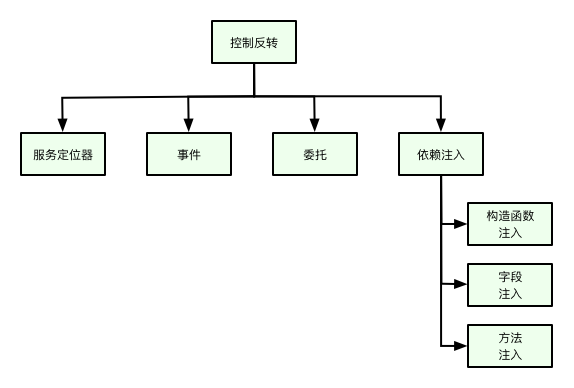

## 简述

控制反转是一种设计思想，适用于任何编程语言。包含了服务定位器(Service Locator)，事件(Events)，委托(Delegates)和依赖注入(Dependency Injection)。到目前为止，Hiboot实现了依赖注入部分，所以我们主要来讲解依赖注入部分。如何编写出松耦合，易维护的应用是Hiboot框架的设计初衷。根据这个设计思想，我们不应该在结构体，函数或方法中静态的配置其依赖，而应该将依赖配置在外部。



依赖注入设计模式允许我们解除应用组件间的强依赖关系，是应用程序松耦合，可扩展和可维护。

Go语言的一个结构体A依赖于另外一个结构体B，如果A用到了B的实例，我们说A依赖B。例如，userController 依赖 userService.

```go

type userController struct {
	web.Controller
	userService service.UserService
}

func newUserController(userService service.UserService) *userController {
	return &userController{
		userService: userService,
	}
}

```

理想的状况是一个Go语言的结构体应该尽量独立以其它结构体。这样可增加结构体的复用性以及可测试性。

## 依赖注入

和前面章节一样，我们还是通过示例来说明Hiboot的依赖注入是如何工作的。

⚠️ 注意：

* 如果你想要注入当是一个实例，依赖注入定义的相关字段或参数，其数据类型必须是结构体指针或interface{}. 如果你尝试定义其它类型将不会成功。
* 依赖注入实例的来源主要有两个，一个是通过app.Register()注册结构体构造器，另外一个是通过[自动配置](/cn/auto-configure)的方法注册。

**正例：**

```go

type Foo struct {
}

func newFoo() *Foo {
    return &Foo{}
}

type Bar struct {
    foo *Foo
}

func newBar(foo *Foo) *Bar {
    return &Bar{
        foo: foo,
    }
}

func init() {
    app.Register(newFoo, newBar)
}

```

**反例：**

在这个反例中，`foo`不是一个指针，将不会被注入。

```go

type Foo struct {
}

func newFoo() *Foo {
    return &Foo{}
}

type Bar struct {
    foo Foo
}

func newBar(foo Foo) *Bar {
    return &Bar{
        foo: foo,
    }
}
func init() {
    app.Register(newFoo, newBar)
}

```

## 构造器注入

Hiboot建议使用构造器来注入，因为构造器注入能够保证注入的组件不可变，并且确保需要的依赖不为空。并且，构造器注入的依赖总数能够保证组件完全初始化的状态。

* 使用构造器注入的字段可以是私有的，不像字段注入，Go语言要求使用标签时，字段必须大写开头，这样就暴露了该字段，这就有被更改的风险。
* 通过构造器注入Hiboot可以保证依赖不会为空。
  
```go

package main

import (
	"github.com/hidevopsio/hiboot/pkg/app/web"
	"github.com/hidevopsio/hiboot/pkg/model"
	"github.com/hidevopsio/hiboot/pkg/starter/jwt"
	"time"
)

// This example shows that jwtToken is injected through the constructor,
// once you imported "github.com/hidevopsio/hiboot/pkg/starter/jwt",
// jwtToken jwt.Token will be injectable.
func main() {
	// the web application entry
	web.NewApplication().Run()
}

// PATH: /login
type loginController struct {
	web.Controller

	token jwt.Token
}

type userRequest struct {
	// embedded field model.RequestBody mark that userRequest is request body
	model.RequestBody
	Username string `json:"username" validate:"required"`
	Password string `json:"password" validate:"required"`
}

func init() {
	// Register Rest Controller through constructor newLoginController
	app.Register(newLoginController)
}

// newLoginController inject jwtToken through the argument jwtToken jwt.Token on constructor
// the dependency jwtToken is auto configured in jwt starter, see https://github.com/hidevopsio/hiboot/tree/master/pkg/starter/jwt
func newLoginController(token jwt.Token) *loginController {
	return &loginController{
		token: token,
	}
}

// Post /
// The first word of method is the http method POST, the rest is the context mapping
func (c *loginController) Post(request *userRequest) (response model.Response, err error) {
	jwtToken, _ := c.token.Generate(jwt.Map{
		"username": request.Username,
		"password": request.Password,
	}, 30, time.Minute)

	response = new(model.BaseResponse)
	response.SetData(jwtToken)

	return
}

```

## 字段注入

我们来将上面这段代码做个些的改动（⚠️ 我们将 token 改成了 Token， 这是因为Go语言定义了标签的字段必须是大写字母开头的，也就是对外公开），不用构造器也是可以注入的。Hiboot通过标签注入实例到字段 `Token` 中, 尽管使用的效果和构造器差不多，但是我们还是建议使用构造器来注入，原因在上面有说明。

```go

package main

import (
	"github.com/hidevopsio/hiboot/pkg/app/web"
	"github.com/hidevopsio/hiboot/pkg/model"
	"github.com/hidevopsio/hiboot/pkg/starter/jwt"
	"time"
)

// This example shows that jwtToken is injected through the constructor,
// once you imported "github.com/hidevopsio/hiboot/pkg/starter/jwt",
// jwtToken jwt.Token will be injectable.
func main() {
	// the web application entry
	web.NewApplication().Run()
}

// PATH: /login
type loginController struct {
	web.Controller

    // Inject Token by tag `inject:""`
	Token jwt.Token `inject:""`
}

type userRequest struct {
	// embedded field model.RequestBody mark that userRequest is request body
	model.RequestBody
	Username string `json:"username" validate:"required"`
	Password string `json:"password" validate:"required"`
}

func init() {
	// Register Rest Controller through constructor newLoginController
	app.Register(newLoginController)
}

// newLoginController inject jwtToken through the argument jwtToken jwt.Token on constructor
// the dependency jwtToken is auto configured in jwt starter, see https://github.com/hidevopsio/hiboot/tree/master/pkg/starter/jwt
func newLoginController() *loginController {
	return &loginController{}
}

// Post /
// The first word of method is the http method POST, the rest is the context mapping
func (c *loginController) Post(request *userRequest) (response model.Response, err error) {
    // c.Token 是通过 inject 标签注入的，可以直接使用
	jwtToken, _ := c.Token.Generate(jwt.Map{
		"username": request.Username,
		"password": request.Password,
	}, 30, time.Minute)

	response = new(model.BaseResponse)
	response.SetData(jwtToken)

	return
}

```

Hiboot字段注入是通过标签\`inject:""\`来实现到。当在某个字段标注了\`inject:""\`，Hiboot会尝试找到相应的实例并且注入到字段中，如果你尝试让Hiboot注入一个不存在的依赖项，Hiboot会在应用启动时报告错误。

如果需要注入的依赖有多个实现，则可以指定名称，比如\`inject:"buzService"\`， Hiboot会先寻找标签当名字，如果该实例不存在则会寻找是否有以该字段名命名当实例，最后才寻找以该字段数据类型命名当实例。

```go

type BxzService interface {
	GetNickname() string
}

type bazService struct {
	Name     string
	nickname string
}

func (s *bazService) GetNickname() string {
	return s.nickname
}

type buzService struct {
	Name     string
	nickname string
}

func (s *buzService) GetNickname() string {
	return s.nickname
}

type bxzServiceImpl struct {
	BxzService
	Name     string
	nickname string
}

func (s *bxzServiceImpl) GetNickname() string {
	return s.nickname
}

type dependencyInjectionTestService struct {
	BxzSvc     BxzService `inject:""`
	BazService BxzService `inject:""`
	BuzService BxzService `inject:""`
	BozService BxzService `inject:"buzService"`
	name       string
}

```

## 方法注入

方法注入是Hiboot的一大特点，下面是Hiboot starter jwt的实际代码。在方法`Middleware()`中依赖了`Token`，Hiboot会自动将`Token`实例注入到`Middleware()`方法的参数`jwtToken Token`。
关于[Hiboot starter](/cn/auto-configure)会在后面章节详细讲解。

```go

// Package jwt provides the hiboot starter for injectable jwt dependency
package jwt

import (
	"github.com/dgrijalva/jwt-go"
	"github.com/hidevopsio/hiboot/pkg/app"
	mw "github.com/iris-contrib/middleware/jwt"
)

type configuration struct {
	app.Configuration

	Properties Properties `mapstructure:"jwt"`
	middleware *Middleware
	token      Token
}

func init() {
	app.Register(newConfiguration)
}

func newConfiguration() *configuration {
	return &configuration{}
}

// Middleware is the jwt handler
func (c *configuration) Middleware(jwtToken Token) *Middleware {
	return NewJwtMiddleware(mw.Config{
		ValidationKeyGetter: func(token *jwt.Token) (interface{}, error) {
			//log.Debug(token)
			return jwtToken.VerifyKey(), nil
		},
		// When set, the middleware verifies that tokens are signed with the specific signing algorithm
		// If the signing method is not constant the ValidationKeyGetter callback can be used to implement additional checks
		// Important to avoid security issues described here: https://auth0.com/blog/2015/03/31/critical-vulnerabilities-in-json-web-token-libraries/
		SigningMethod: jwt.SigningMethodRS256,
	})
}

// Token
func (c *configuration) Token() Token {
	t := new(jwtToken)
	t.Initialize(&c.Properties)
	return t
}

```